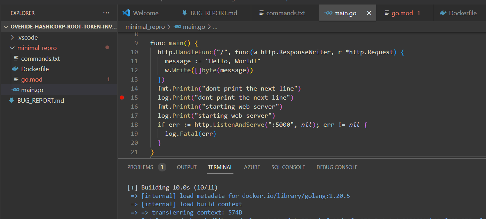
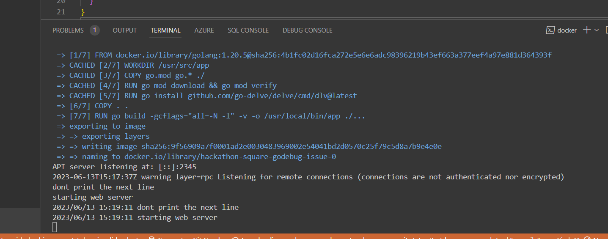
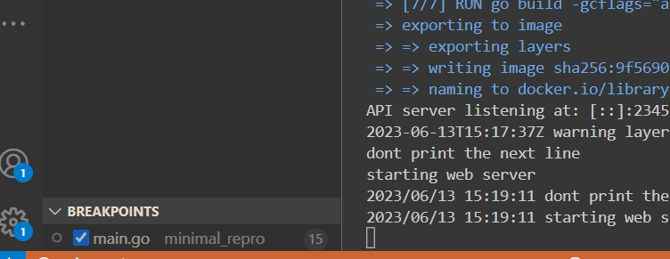
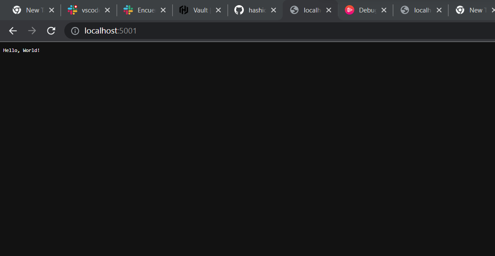
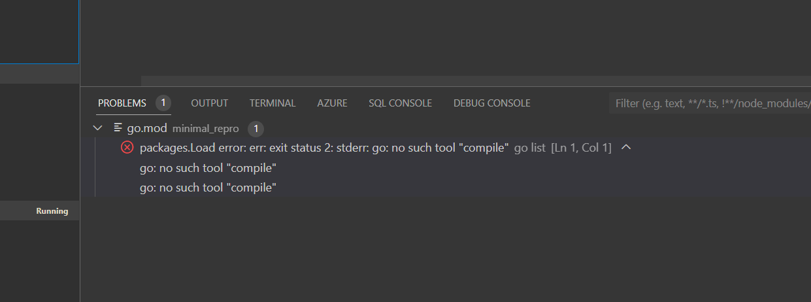

#

## Links to issue
*[Github](https://github.com/WindMillCode/overide-hashicorp-root-token-invalid-value)

### Problem
Greetings,

I am currently facing an issue related to setting the root token ID to a previous value in the HashiCorp Vault Go code. I have tried debugging the application using dlv debug within a Docker container. However, when attempting to run the application on my Windows machine, it hangs. Although the application eventually runs on the Docker machine, I encountered an issue with the debugger not functioning properly when setting breakpoints.

To provide a better understanding of the problem, I have attached a minimal reproduction of the issue on GitHub. You can find it at the following link: GitHub - WindMillCode/overide-hashicorp-root-token-invalid-value.

I kindly request the to help me resolve this problem as quickly as possible

Thank you in advance.

## Current Behavior
When I run the application via start debugging and I set breakpoints the debugging skips over the breakpoints not allowing me to explore the code. My use case I am working with the [hashicorp vault code](https://github.com/hashicorp/vault) trying to put break points ultimately to modify the code to accept any dev token I give it (right now its rejecting using its own tokens). I am using this course for reference https://app.pluralsight.com/library/courses/go-debugging/table-of-contents.

* This is the breakpoint
[FILE](minimal_repro\main.go)

* We can see after I start debugging the breakpoint is skipped

* and I can access the application as its has gotten to http.ListenAndServe

## Expected Behavior
stop at the breakpoint and I should get connection refesued if I try to open the application in the browser

## Possible Solution
* does the go in the docker and the go in my local have to be the same verison I feel like it defeats the point
* I am getting in go.mod

## Steps to Reproduce

### Pre reqs
install docker and  go1.20 on the computer and

1. Go to project root in terminal
2. Copy paste and run commands in terminal minimal_repro\commands.txt
3. set a breakpoint on  line 15 in minimal_repro\main.go
3. Click [Top left of vscode > Run > Start debugging]
4. access localhost:5001 in the browser if you access it this means the debugger did not work

## Environment
* Local machine
go version go1.20.5 windows/amd64
OS Name:                   Microsoft Windows 11 Pro
OS Version:                10.0.22621 N/A Build 22621
System Manufacturer:       LENOVO
System Model:              82SX
System Type:               x64-based PC

* Docker container
go version go1.20.5 windows/amd64
Linux 23fb080a459e 5.15.90.1-microsoft-standard-WSL2 #1 SMP Fri Jan 27 02:56:13 UTC 2023 x86_64 GNU/Linux

## Files

## Detailed Description

## Possible Implementation

## Additional Issues
