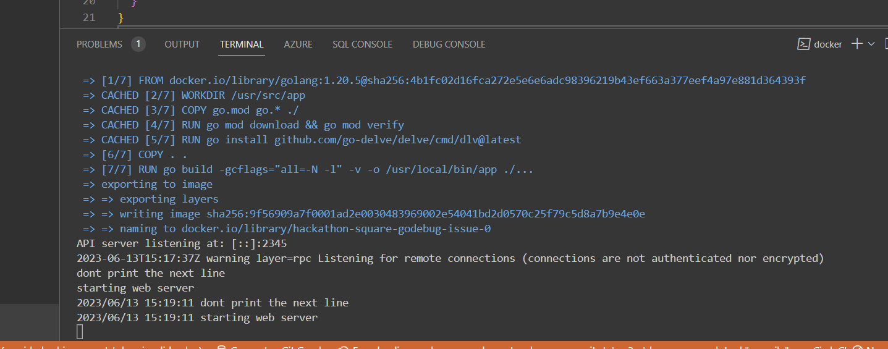
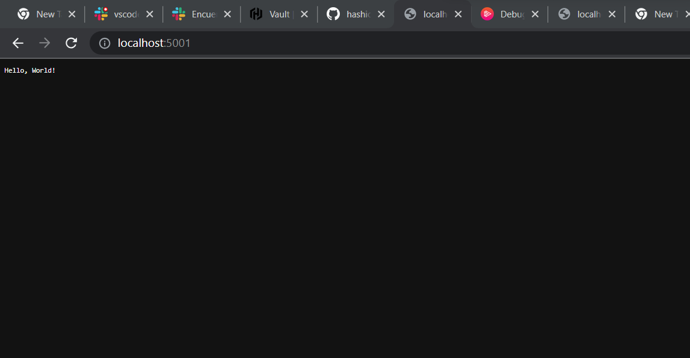

Please answer the following before submitting your issue:

Note: Please include any substantial examples (debug session output,
stacktraces, etc) as linked gists.

[gist for debug session output](https://gist.github.com/windmillcode0/40aaa2c0c3effb92084019c55c4e5cf3

If this is about source listing not showing up (or breakpoints not being
accepted) while running in a container please read our
[FAQ](https://github.com/go-delve/delve/blob/master/Documentation/faq.md#substpath)
first.

1. What version of Delve are you using (`dlv version`)?

Container
Delve Debugger
Version: 1.20.2
Build: $Id: e0c278ad8e0126a312b553b8e171e81bcbd37f60 $
Local
Delve Debugger
Version: 1.20.2
Build: $Id: e0c278ad8e0126a312b553b8e171e81bcbd37f60 $
3. What version of Go are you using? (`go version`)?
3a
Container
go version go1.20.5 linux/amd64
Local
go version go1.20.5 windows/amd64
4. What operating system and processor architecture are you using?

* Local machine
go version go1.20.5 windows/amd64
OS Name:                   Microsoft Windows 11 Pro
OS Version:                10.0.22621 N/A Build 22621
System Manufacturer:       LENOVO
System Model:              82SX
System Type:               x64-based PC

* Docker container
Linux 23fb080a459e 5.15.90.1-microsoft-standard-WSL2 #1 SMP Fri Jan 27 02:56:13 UTC 2023 x86_64 GNU/Linux

5. What did you do?

## Steps to Reproduce

### Pre reqs
install docker and  go1.20 on the computer and

1. Go to project root in terminal
2. Copy paste and run commands in terminal minimal_repro\commands.txt
3. set a breakpoint on  line 15 in minimal_repro\main.go
4. Click [Top left of vscode > Run > Start debugging]
5. access localhost:5001 in the browser if you access it this means the debugger did not work

6. What did you expect to see?

stop at the breakpoint and I should get connection refesued if I try to open the application in the browser

7. What did you see instead?
When I run the application via start debugging and I set breakpoints the debugging skips over the breakpoints not allowing me to explore the code. My use case I am working with the [hashicorp vault code](https://github.com/hashicorp/vault) trying to put break points ultimately to modify the code to accept any dev token I give it (right now its rejecting using its own tokens). I am using this course for reference https://app.pluralsight.com/library/courses/go-debugging/table-of-contents.

* This is the breakpoint
[FILE](minimal_repro\main.go)

* We can see after I start debugging the breakpoint is skipped

* and I can access the application as its has gotten to http.ListenAndServe

* according to this [link](https://github.com/go-delve/delve/blob/master/Documentation/faq.md#substpath) I can the content of main.go

